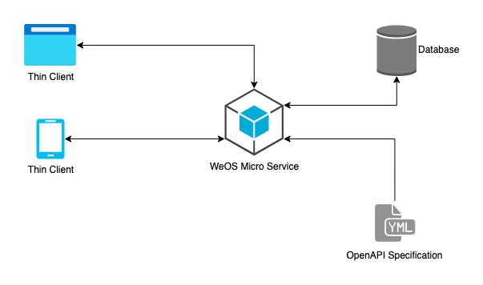



WeOS is an open-source system for creating microservice APIs and applications
built upon the OpenAPI specification.

Use OpenAPI to model your data, create data stores, configure routes,
set up endpoints, and specify middleware.
WeOS will process your specification and generate the API.

Develop sophisticated microservices with custom business logic by implementing
your own controllers and middleware.





## WeOS
With WeOS, realizing domain-driven design is easy using OpenAPI's declarative specification and a microservice architecture.

    

Your microservice is simply the standalone WeOS binary
(available for Windows, Linux, and MacOS) + your OpenAPI spec file.

## OpenAPI
Using the standardized [OpenAPI 3.0.3 API specification][openapi] allows:
- a design-first approach to modeling your domain
- access to a [rich ecosystem of tooling][tools]

[openapi]: https://spec.openapis.org/oas/v3.0.3
[tools]: https://openapi.tools/

## WeOS + OpenAPI
Given an OpenAPI spec, WeOS will generate a RESTful API with built-in:
- **database connections**: support for SQLite, MySQL, MariaDB, Postgres
- **event sourcing**: source events from databases or other services
- **middleware**: including RequestID, Recover, Logger


