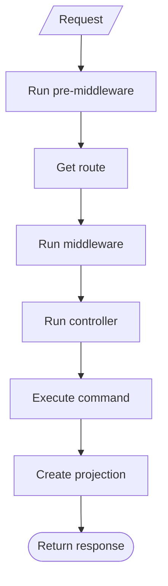

When WeOS receives a request to an endpoint, it first runs any
pre-[middleware][middleware]. It then gets the route specified in your OpenAPI spec, followed by running any additional [middleware][middleware]. From here,
the associated [controller][controllers] takes over, which executes the
[command][commands] to handle the request type. A [projection][projections] is created
and WeOS responds by returning relevant data.

[middleware]: /docs/concepts/middleware
[controllers]: /docs/concepts/controllers
[commands]: /docs/concepts/commands
[projections]: /docs/concepts/projections
