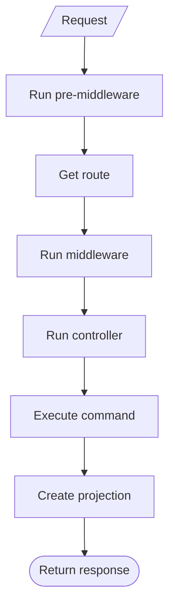

WeOS takes a design-first approach using [OpenAPI specifications][openapi]. WeOS uses the OpenAPI specification to set up routes
and automatically associate controllers. WeOS attempts to allow developers to get a lot done with "vanilla" OpenAPI,
although you can use [OpenAPI extensions][extensions] to provide additional customizations and configurations.

When WeOS receives a request to an endpoint, it first runs any
pre-[middleware][middleware]. It then gets the route specified in your OpenAPI spec, followed by running any additional [middleware][middleware]. From here,
the associated [controller][controllers] takes over, which executes the
[command][commands] to handle the request type. A [projection][projections] is created
and WeOS responds by returning relevant data.

[middleware]: /docs/user-guide/middleware
[controllers]: /docs/user-guide/controllers
[commands]: /docs/user-guide/commands
[projections]: /docs/user-guide/projections
[openapi]: https://www.openapis.org/
[extensions]: /docs/openapi-extensions
